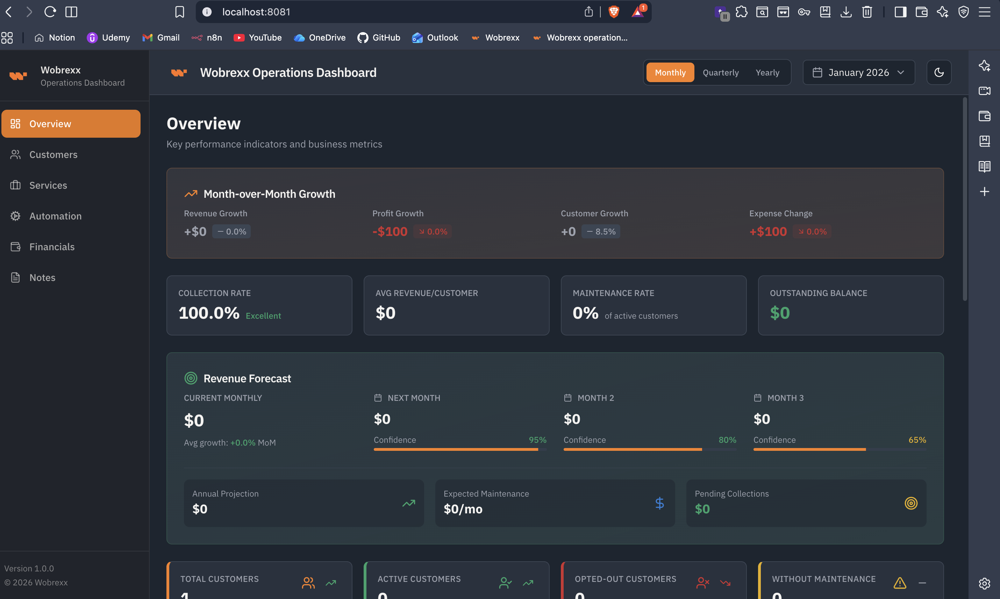
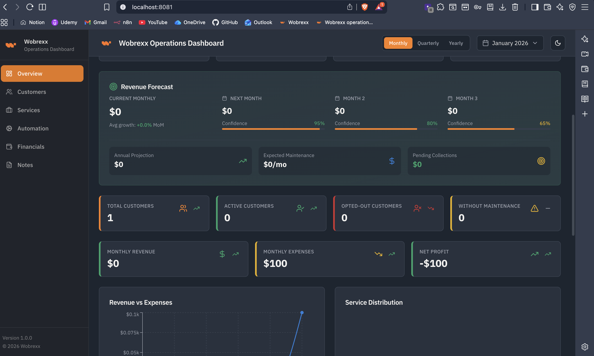
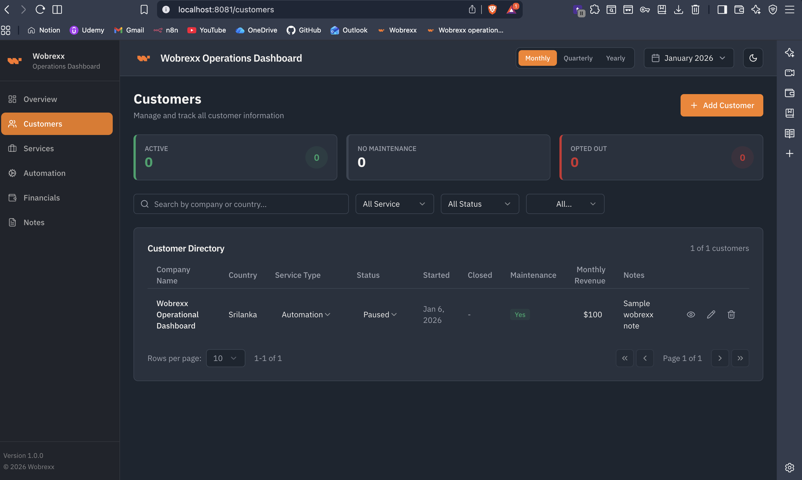
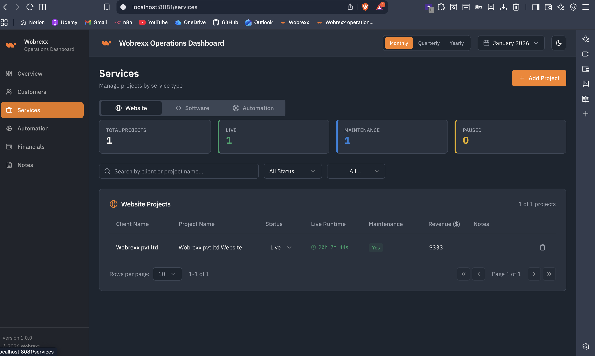
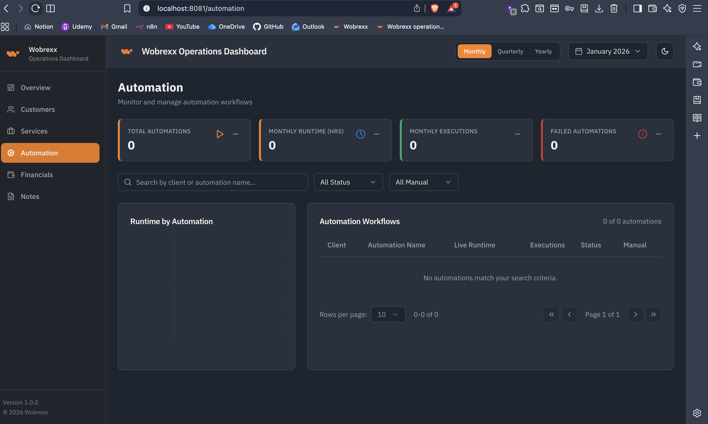
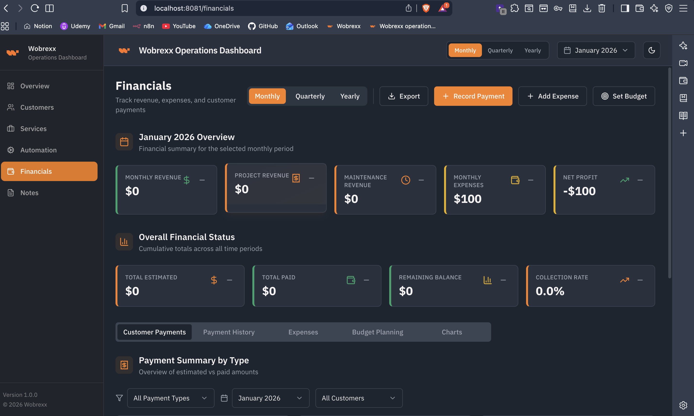
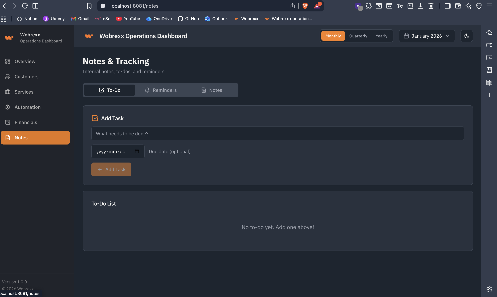

# 🚀 Wobrexx Operations Dashboard

A comprehensive, modern operations management dashboard designed for service-based businesses to track customers, projects, finances, automations, and more. Built with React, TypeScript, and featuring dual-database architecture for optimal performance and reliability.



---

## 🎥 Demo Video

Watch a comprehensive screen recording walkthrough of the Wobrexx Operations Dashboard:

[](https://www.youtube.com/watch?v=eLTVl3wXBZM)

---

## 📋 Table of Contents

- [Demo Video](#-demo-video)
- [Problem It Solves](#-problem-it-solves)
- [Who Needs This App](#-who-needs-this-app)
- [Features](#-features)
- [Technologies Used](#-technologies-used)
- [Getting Started](#-getting-started)
- [Database Configuration](#-database-configuration)
- [Why Two Databases?](#-why-two-databases)
- [Project Structure](#-project-structure)
- [Deployment](#-deployment)
- [Contributing](#-contributing)
- [License](#-license)

---

## 🎯 Problem It Solves

Running a service-based business (web development, software consulting, automation services) comes with numerous operational challenges:

- **Customer Management**: Tracking multiple clients, their service types, payment status, and maintenance schedules
- **Financial Tracking**: Monitoring revenue, expenses, project payments, and maintenance fees across different payment types
- **Project Oversight**: Managing multiple projects with different statuses (Live, Development, Paused, Completed)
- **Automation Monitoring**: Tracking automation scripts, their runtime, execution counts, and health status
- **Data Fragmentation**: Information scattered across spreadsheets, emails, and various tools
- **No Centralized View**: Lack of a single dashboard to see business health at a glance
- **Offline Access**: Need to work without internet connection
- **Cross-Device Sync**: Access data from multiple devices seamlessly

**This dashboard solves all these problems** by providing a unified, modern interface to manage all aspects of your operations in one place.

---

## 👥 Who Needs This App

This dashboard is perfect for:

- **Freelance Developers** managing multiple client projects
- **Small Software Agencies** tracking customers, projects, and finances
- **Automation Service Providers** monitoring scripts and client automations
- **Consulting Firms** managing client relationships and project timelines
- **SaaS Startups** tracking MRR, expenses, and customer health
- **Service-Based Businesses** needing a comprehensive operations management tool
- **Solo Entrepreneurs** who need professional-grade tools without enterprise costs

**Ideal for businesses that:**
- Have 5-100+ customers
- Manage multiple projects simultaneously
- Need to track recurring revenue (MRR)
- Require offline access to their data
- Want to avoid expensive enterprise solutions
- Need real-time financial insights

---

## ✨ Features

### 📊 **Overview Dashboard**


- Real-time KPI cards (Total Customers, Active Customers, Monthly Revenue, Net Profit)
- Interactive charts (Revenue vs Expenses, Service Distribution, Customer Status)
- Month-over-month growth indicators
- Quick insights into business health

### 👥 **Customer Management**


- Complete customer database with company details
- Track service types (Website, Software, Automation, Mixed)
- Customer status management (Active, Paused, Opted Out)
- Payment tracking (Project, Maintenance, New Requirements)
- Maintenance schedule tracking with due dates
- Inline editing capabilities
- Advanced search and filtering
- Customer detail view with full history

### 💼 **Services/Projects Management**


- Track all projects by type (Website, Software, Automation)
- Project status tracking (Live, Development, Paused, Completed)
- Revenue tracking per project
- Maintenance status per project
- Filter and search functionality
- Tabbed interface for different service types

### 🤖 **Automation Monitoring**

- Track automation scripts and their performance
- Runtime monitoring
- Execution count tracking
- Health status (Healthy, Warning, Failed)
- Manual intervention flags
- Runtime charts and analytics
- Filter by status and client

### 💰 **Financial Management**

- Comprehensive financial dashboard
- Track project payments, maintenance fees, and new requirements
- Expense management with categories
- Budget tracking and monitoring
- Payment history with detailed records
- Financial KPIs (MRR, One-time Revenue, Total Expenses, Net Profit)
- Export financial reports (PDF, CSV)
- Maintenance payment tracking by month
- Visual financial charts and trends

### 📝 **Notes & Reminders**

- Create notes, todos, and reminders
- Mark tasks as completed
- Date-based organization
- Quick access to important information

### 🎨 **Modern UI/UX**
- Dark/Light theme support
- Responsive design (works on desktop, tablet, mobile)
- Beautiful, modern interface built with shadcn/ui
- Smooth animations and transitions
- Intuitive navigation
- Accessible components

### 💾 **Data Management**
- **Offline-First**: Works without internet connection
- **Auto-Sync**: Automatically syncs when online
- **Cross-Device**: Access from any device
- **Data Persistence**: Never lose your data
- **Export/Import**: Backup and restore functionality

---


## 🛠 Technologies Used

### Frontend Framework
- **React 18.3** - Modern UI library
- **TypeScript** - Type-safe development
- **Vite** - Fast build tool and dev server

### UI Components & Styling
- **shadcn/ui** - High-quality React components
- **Radix UI** - Accessible component primitives
- **Tailwind CSS** - Utility-first CSS framework
- **Lucide React** - Beautiful icon library
- **Recharts** - Chart library for data visualization

### State Management & Routing
- **React Context API** - Global state management
- **React Router DOM** - Client-side routing
- **TanStack Query** - Data fetching and caching

### Forms & Validation
- **React Hook Form** - Performant forms
- **Zod** - Schema validation

### Databases
- **Dexie.js** - IndexedDB wrapper for offline storage
- **Supabase** - PostgreSQL cloud database for sync

### Additional Libraries
- **date-fns** - Date manipulation
- **jsPDF** - PDF generation for exports
- **jspdf-autotable** - PDF table generation
- **next-themes** - Theme management

### Development Tools
- **ESLint** - Code linting
- **TypeScript ESLint** - TypeScript-specific linting
- **PostCSS** - CSS processing
- **Autoprefixer** - CSS vendor prefixing

---

## 🚀 Getting Started

### Prerequisites

- **Node.js** 18+ and npm (or yarn/pnpm)
- **Git** for version control
- **Supabase Account** (free tier works perfectly) - [Sign up here](https://supabase.com)

### Installation

1. **Clone the repository**
   ```bash
   git clone https://github.com/Wobrexx/Wobrexx-operations-dashboard.git
   cd Wobrexx-operations-dashboard
   ```

2. **Install dependencies**
   ```bash
   npm install
   ```

3. **Set up environment variables**
   
   Create a `.env` file in the root directory:
   ```env
   VITE_SUPABASE_URL=your-supabase-project-url
   VITE_SUPABASE_ANON_KEY=your-supabase-anon-key
   ```
   
   > **Note**: If you want to use only IndexedDB (offline mode), you can skip this step. The app will work without Supabase credentials.

4. **Start the development server**
   ```bash
   npm run dev
   ```

5. **Open your browser**
   
   Navigate to `http://localhost:8080` (or the port shown in terminal)

---

## 💾 Database Configuration

This application uses a **dual-database architecture** for optimal performance and reliability. Here's how to set up both:

### Option 1: IndexedDB Only (Offline Mode)

**No configuration needed!** The app works out of the box with IndexedDB (Dexie.js). Data is stored locally in your browser.

**Pros:**
- ✅ Zero setup required
- ✅ Works completely offline
- ✅ Fast and instant
- ✅ No external dependencies

**Cons:**
- ❌ Data only available in the same browser
- ❌ No cross-device sync

### Option 2: Supabase + IndexedDB (Recommended)

This setup gives you the best of both worlds: offline capability + cloud sync.

#### Step 1: Create Supabase Project

1. Go to [https://supabase.com](https://supabase.com)
2. Sign up (free) or log in
3. Click **"New Project"**
4. Fill in:
   - **Name**: `Wobrexx Operations Dashboard`
   - **Database Password**: Create a strong password (save it!)
   - **Region**: Choose closest to you
   - **Pricing Plan**: Free
5. Wait 2-3 minutes for project to be ready

#### Step 2: Get API Credentials

1. In Supabase dashboard, go to **Settings** → **API**
2. Copy:
   - **Project URL** (looks like: `https://xxxxx.supabase.co`)
   - **anon/public key** (long string starting with `eyJ...`)

#### Step 3: Configure Environment Variables

Add to your `.env` file:
```env
VITE_SUPABASE_URL=https://your-project-id.supabase.co
VITE_SUPABASE_ANON_KEY=your-anon-key-here
```

#### Step 4: Create Database Tables

1. In Supabase dashboard, go to **SQL Editor**
2. Click **"New query"**
3. Open `supabase-schema.sql` from this project
4. Copy all SQL and paste it
5. Click **Run** (or press Cmd/Ctrl + Enter)

#### Step 5: Set Up Row Level Security (RLS)

Run this SQL in the SQL Editor:

```sql
-- Enable RLS
ALTER TABLE customers ENABLE ROW LEVEL SECURITY;
ALTER TABLE automations ENABLE ROW LEVEL SECURITY;
ALTER TABLE projects ENABLE ROW LEVEL SECURITY;
ALTER TABLE expenses ENABLE ROW LEVEL SECURITY;
ALTER TABLE notes ENABLE ROW LEVEL SECURITY;
ALTER TABLE payment_history ENABLE ROW LEVEL SECURITY;
ALTER TABLE budgets ENABLE ROW LEVEL SECURITY;

-- Allow all operations (for single-user app)
CREATE POLICY "Allow all" ON customers FOR ALL USING (true) WITH CHECK (true);
CREATE POLICY "Allow all" ON automations FOR ALL USING (true) WITH CHECK (true);
CREATE POLICY "Allow all" ON projects FOR ALL USING (true) WITH CHECK (true);
CREATE POLICY "Allow all" ON expenses FOR ALL USING (true) WITH CHECK (true);
CREATE POLICY "Allow all" ON notes FOR ALL USING (true) WITH CHECK (true);
CREATE POLICY "Allow all" ON payment_history FOR ALL USING (true) WITH CHECK (true);
CREATE POLICY "Allow all" ON budgets FOR ALL USING (true) WITH CHECK (true);
```

#### Step 6: Restart Dev Server

```bash
npm run dev
```

#### Step 7: Verify Connection

1. Open browser console (F12)
2. You should see: `🔄 Loading data from Supabase...`
3. Add a customer and check Supabase dashboard → **Table Editor** → **customers**
4. Your data should appear! 🎉

> **📚 For detailed setup instructions, see [SUPABASE_SETUP.md](./SUPABASE_SETUP.md) or [QUICK_START.md](./QUICK_START.md)**

---

## 🔄 Why Two Databases?

This application uses a **dual-database architecture** combining **IndexedDB (Dexie.js)** and **Supabase (PostgreSQL)**. Here's why:

### The Problem with Single Database Solutions

**Cloud-only (Supabase only):**
- ❌ Requires internet connection
- ❌ Slow when offline
- ❌ Poor user experience without connectivity
- ❌ Data loss risk if sync fails

**Local-only (IndexedDB only):**
- ❌ Data stuck in one browser
- ❌ No cross-device access
- ❌ Data loss if browser data is cleared
- ❌ No backup solution

### The Solution: Hybrid Architecture

**IndexedDB (Dexie.js) - Primary Storage**
- ✅ **Instant access** - No network latency
- ✅ **Offline-first** - Works without internet
- ✅ **Fast reads/writes** - Local storage is blazing fast
- ✅ **Always available** - No dependency on external services
- ✅ **Zero cost** - Built into browsers

**Supabase (PostgreSQL) - Sync & Backup**
- ✅ **Cross-device sync** - Access from anywhere
- ✅ **Cloud backup** - Never lose your data
- ✅ **Real-time sync** - Changes appear on all devices
- ✅ **Scalable** - Handles growth easily
- ✅ **Free tier** - 500MB storage, 2M requests/month

### How They Work Together

```
┌─────────────────────────────────────────────────┐
│           User Action (Add/Edit/Delete)        │
└───────────────────┬───────────────────────────┘
                    │
        ┌───────────┴───────────┐
        │                       │
        ▼                       ▼
┌──────────────┐        ┌──────────────┐
│  IndexedDB   │        │   Supabase   │
│  (Instant)   │        │  (Background)│
│              │        │              │
│ ✅ Immediate │        │ ✅ Sync when  │
│ ✅ Offline   │        │    online     │
│ ✅ Fast       │        │ ✅ Backup     │
└──────────────┘        └──────────────┘
```

**Flow:**
1. User makes a change → **Saved to IndexedDB immediately** (instant feedback)
2. If online → **Synced to Supabase in background** (cloud backup)
3. On app load → **Load from Supabase first** (latest data), fallback to IndexedDB
4. If offline → **Works with IndexedDB only**, syncs when connection restored

### Benefits

- **Best User Experience**: Instant saves, no waiting
- **Reliability**: Works offline, syncs when online
- **Data Safety**: Local + cloud backup
- **Performance**: Fast local storage + cloud sync
- **Flexibility**: Works with or without Supabase

---

## 📁 Project Structure

```
Wobrexx-operations-dashboard/
├── src/
│   ├── components/          # Reusable UI components
│   │   ├── charts/         # Chart components
│   │   ├── dashboard/      # Dashboard-specific components
│   │   ├── layout/         # Layout components (Header, Sidebar)
│   │   └── ui/             # shadcn/ui components
│   ├── contexts/           # React contexts (Dashboard, Theme)
│   ├── hooks/              # Custom React hooks
│   ├── lib/                # Utilities and configurations
│   │   ├── database.ts    # IndexedDB (Dexie) setup
│   │   ├── supabase.ts    # Supabase client
│   │   └── syncService.ts # Sync logic
│   ├── pages/              # Page components
│   │   ├── Overview.tsx
│   │   ├── Customers.tsx
│   │   ├── Services.tsx
│   │   ├── Automation.tsx
│   │   ├── Financials.tsx
│   │   └── Notes.tsx
│   ├── utils/              # Utility functions
│   ├── App.tsx             # Main app component
│   └── main.tsx            # Entry point
├── public/                 # Static assets
├── supabase-schema.sql     # Database schema
├── .env.example            # Environment variables template
├── package.json
└── README.md
```

---

## 🚢 Deployment

### Deploy to Vercel (Recommended)

1. **Push to GitHub**
   ```bash
   git push origin main
   ```

2. **Import to Vercel**
   - Go to [vercel.com](https://vercel.com)
   - Click "New Project"
   - Import your GitHub repository
   - Add environment variables:
     - `VITE_SUPABASE_URL`
     - `VITE_SUPABASE_ANON_KEY`
   - Click "Deploy"

3. **Done!** Your app is live 🎉

### Deploy to Netlify

1. **Build the project**
   ```bash
   npm run build
   ```

2. **Deploy**
   - Go to [netlify.com](https://netlify.com)
   - Drag and drop the `dist` folder
   - Or connect your GitHub repo
   - Add environment variables in site settings

### Other Platforms

The app can be deployed to any static hosting service:
- **GitHub Pages**
- **Cloudflare Pages**
- **AWS S3 + CloudFront**
- **Any static host**

---

## 🤝 Contributing

Contributions are welcome! Please feel free to submit a Pull Request.

1. Fork the repository
2. Create your feature branch (`git checkout -b feature/AmazingFeature`)
3. Commit your changes (`git commit -m 'Add some AmazingFeature'`)
4. Push to the branch (`git push origin feature/AmazingFeature`)
5. Open a Pull Request

---

## 📄 License

This project is licensed under the MIT License - see the LICENSE file for details.

---

## 🙏 Acknowledgments

- Built with [React](https://react.dev)
- UI components from [shadcn/ui](https://ui.shadcn.com)
- Icons from [Lucide](https://lucide.dev)
- Charts from [Recharts](https://recharts.org)
- Database by [Supabase](https://supabase.com) and [Dexie.js](https://dexie.org)

---

## 📞 Support

For issues, questions, or suggestions:
- Open an issue on [GitHub](https://github.com/Wobrexx/Wobrexx-operations-dashboard/issues)
- Check the [Documentation](./SUPABASE_SETUP.md)

---

## 🎉 Thank You!

Thank you for using Wobrexx Operations Dashboard! If you find it useful, please consider giving it a ⭐ on GitHub.

---

**Made by Wobrexx 🧡 for service-based businesses**
